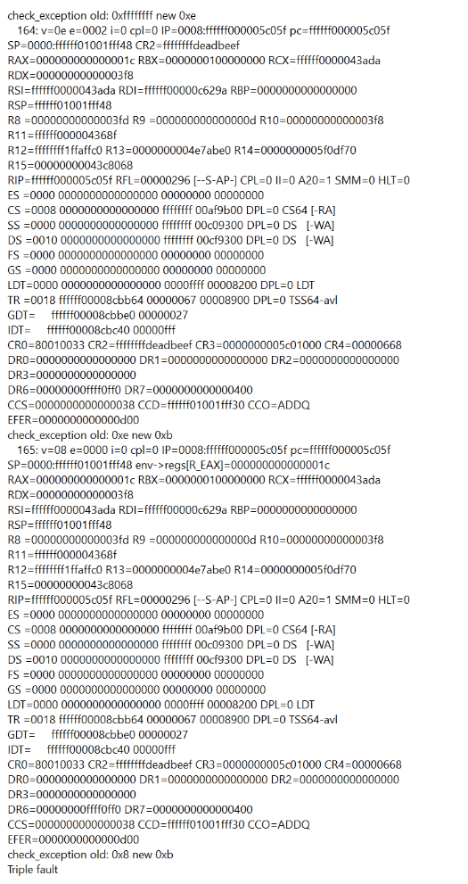
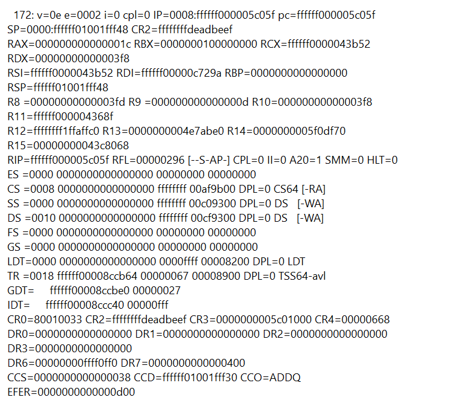
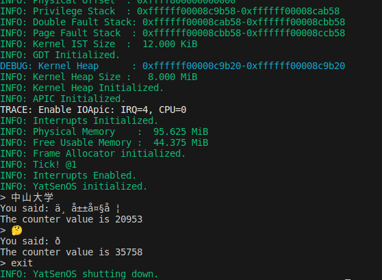

* content
{:toc}
# 实验要求

1.  了解中断的作用、中断的分类、中断的处理过程。

2.  启用基于 `APIC` 的中断，注册 `IDT` 中断处理程序，实现时钟中断。

3.  注册内核堆分配器。（不实现内存分配算法，使用现有代码赋予内核堆分配能力）

4.  实现串口驱动的输入能力，尝试进行基础的 `IO` 操作和交互。


# 实验过程

## `GDT` 与 `TSS`

阅读文档了解了x64 架构中的 `GDT`、`TSS` 和 `IDT`。同时在
`src/memory/gdt.rs` 中补全了TSS的中断栈表，为 `Double Fault` 和
`Page Fault` 准备独立的栈。

## 注册中断处理程序

先在`mod.rs`中初始化`APIC`（这里主要是调用后续完成的`xapic.rs`），然后在'exception.rs'中为各种常见的CPU异常注册中断处理程序。然后在`src/interrupt`
目录下创建 `clock.rs` 和 `serial.rs` 两个文件为后续工作做准备。

## 初始化 `APIC`

了解了`APIC`的工作原理，然后参照相关文档在`xapic.rs`中实现了`APIC`的初始化，主要完成的步骤如下：

-   检测系统是否存在`APIC`。

-   确定`APIC`的地址空间，即`LAPIC`和`IOAPIC`的`MMIO`地址空间，并将其映射到虚拟地址空间。

-   启用`APIC`并设置`Spurious IRQ Vector`。

-   设置计时器相关寄存器。

-   禁用`LVT LINT0`，`LVT LINT1`，`LVT PCINT`。

-   设置错误中断`LVT Error`到对应的中断向量号。

-   清除错误状态寄存器。

-   向 `EOI` 寄存器写入 0 以确认任何挂起的中断

-   设置`ICR`寄存器。

-   设置`TPR`寄存器为0，允许接收中断。

## 时钟中断

在`clock.rs`中使用原子操作实现了一个线程安全的全局计数器，可以在多线程环境下安全地对计数器进行读取和增加操作。

再在`lib.rs`中，所有组件初始化完毕后为CPU开启中断。（记得没错的话，这一部分不是由我完成的）

-   补全上述代码任务，并尝试修改你的代码，调节时钟中断的频率，并观察
    QEMU
    中的输出。说明你修改了哪些代码，如果想要中断的频率减半，应该如何修改？

为了使得时钟中断的频率不同带来的效果更加显著，我分别将时钟中断的频率设置为正常频率（左图）和正常频率的1/128（右图）。

:::: box
::: {.columns-flow count="2"}
{width="100%"}

{width="98%"}
:::
::::

可以很明显地看到，右图中输出的计数器的值的变化明显更慢。

我将`xapic.rs`中的下面这一行的`0b1011`改为`0b1010`。如果想要中断的频率减半，则应该改为`0b0000`。

``` rust
self.write(DIVIDE_CONFIGURATION, 0b1011);
```

## 串口输入中断

在`uart16550.rs`为串口设备开启中断，再在`mod.rs`里为 `IOAPIC` 启用对应的
`IRQ`。

接着创建`src/drivers/input.rs`，我选择推荐的`crossbeam_queue::ArrayQueue`
作为缓冲区的实现，使用`lazy_static`初始化`INPUT_BUFFER`，再利用所提供的`try_pop_key`函数实现`pop_key`函数，最后依照给定的逻辑实现`get_line`函数。

实现完'input.rs'后，我在`serial.rs`中调用`push_key`函数完成`receive`函数。

## 用户交互

将`src/main.rs`替换成所给的代码，其中使用了`get_line`函数来获取用户输入的一行数据，并将其打印出来，实现响应用户输入的操作。

# 关键代码

`gdt.rs`

``` rust
tss.interrupt_stack_table[DOUBLE_FAULT_IST_INDEX as usize] = {
            const STACK_SIZE: usize = IST_SIZES[1];
            static mut STACK: [u8; STACK_SIZE] = [0; STACK_SIZE];
            let stack_start = VirtAddr::from_ptr(unsafe { STACK.as_ptr() });
            let stack_end = stack_start + STACK_SIZE;
            info!(
                "Double Fault Stack: 0x{:016x}-0x{:016x}",
                stack_start.as_u64(),
                stack_end.as_u64()
            );
            stack_end
        };

        tss.interrupt_stack_table[PAGE_FAULT_IST_INDEX as usize] = {
            const STACK_SIZE: usize = IST_SIZES[2];
            static mut STACK: [u8; STACK_SIZE] = [0; STACK_SIZE];
            let stack_start = VirtAddr::from_ptr(unsafe { STACK.as_ptr() });
            let stack_end = stack_start + STACK_SIZE;
            info!(
                "Page Fault Stack  : 0x{:016x}-0x{:016x}",
                stack_start.as_u64(),
                stack_end.as_u64()
            );
            stack_end
        };
```

`mod.rs`

``` rustpub
fn init() {
    IDT.load();

    // FIXME: check and init APIC
    if XApic::support() {
        let mut lapic = unsafe { XApic::new(physical_to_virtual(LAPIC_ADDR)) };
        lapic.cpu_init();
        info!("APIC Initialized.");
    } else {
        panic!("APIC not supported!");
    }

    // FIXME: enable serial irq with IO APIC (use enable_irq)
    enable_irq(Irq::Serial0 as u8, 0); // enable IRQ4 for CPU0

    info!("Interrupts Initialized.");
}
```

'exceptions.rs'

``` rust
pub unsafe fn register_idt(idt: &mut InterruptDescriptorTable) {
    ...
    // TODO: you should handle more exceptions here
    // especially gerneral protection fault (GPF)
    // see: https://wiki.osdev.org/Exceptions
    idt.debug.set_handler_fn(debug_handler);
    idt.breakpoint.set_handler_fn(breakpoint_handler);
    idt.overflow.set_handler_fn(overflow_handler);
    idt.bound_range_exceeded.set_handler_fn(bound_range_exceeded_handler);
    idt.invalid_opcode.set_handler_fn(invalid_opcode_handler);
    idt.device_not_available.set_handler_fn(device_not_available_handler);
    idt.invalid_tss.set_handler_fn(invalid_tss_handler);
    idt.segment_not_present.set_handler_fn(segment_not_present_handler);
    idt.stack_segment_fault.set_handler_fn(stack_segment_fault_handler);
    idt.general_protection_fault.set_handler_fn(general_protection_fault_handler);

    idt.non_maskable_interrupt.set_handler_fn(non_maskable_interrupt_handler);
    idt.x87_floating_point.set_handler_fn(x87_floating_point_handler);
    idt.alignment_check.set_handler_fn(alignment_check_handler);
    idt.machine_check.set_handler_fn(machine_check_handler);
    idt.simd_floating_point.set_handler_fn(simd_floating_point_handler);
    idt.virtualization.set_handler_fn(virtualization_handler);
    idt.security_exception.set_handler_fn(security_exception_handler);
}

...

pub extern "x86-interrupt" fn debug_handler(stack_frame: InterruptStackFrame) {
    panic!("EXCEPTION: DEBUG\n\n{:#?}", stack_frame);
}

pub extern "x86-interrupt" fn breakpoint_handler(stack_frame: InterruptStackFrame) {
    panic!("EXCEPTION: BREAKPOINT\n\n{:#?}", stack_frame);
}

pub extern "x86-interrupt" fn overflow_handler(stack_frame: InterruptStackFrame) {
    panic!("EXCEPTION: OVERFLOW\n\n{:#?}", stack_frame);
}

pub extern "x86-interrupt" fn bound_range_exceeded_handler(stack_frame: InterruptStackFrame) {
    panic!("EXCEPTION: BOUND RANGE EXCEEDED\n\n{:#?}", stack_frame);
}

pub extern "x86-interrupt" fn invalid_opcode_handler(stack_frame: InterruptStackFrame) {
    panic!("EXCEPTION: INVALID OPCODE\n\n{:#?}", stack_frame);
}

pub extern "x86-interrupt" fn device_not_available_handler(stack_frame: InterruptStackFrame) {
    panic!("EXCEPTION: DEVICE NOT AVAILABLE\n\n{:#?}", stack_frame);
}

pub extern "x86-interrupt" fn invalid_tss_handler(
    stack_frame: InterruptStackFrame,
    error_code: u64,
) {
    panic!(
        "EXCEPTION: INVALID TSS, ERROR_CODE: 0x{:016x}\n\n{:#?}",
        error_code, stack_frame
    );
}

pub extern "x86-interrupt" fn segment_not_present_handler(
    stack_frame: InterruptStackFrame,
    error_code: u64,
) {
    panic!(
        "EXCEPTION: SEGMENT NOT PRESENT, ERROR_CODE: 0x{:016x}\n\n{:#?}",
        error_code, stack_frame
    );
}

pub extern "x86-interrupt" fn stack_segment_fault_handler(
    stack_frame: InterruptStackFrame,
    error_code: u64,
) {
    panic!(
        "EXCEPTION: STACK SEGMENT FAULT, ERROR_CODE: 0x{:016x}\n\n{:#?}",
        error_code, stack_frame
    );
}

pub extern "x86-interrupt" fn general_protection_fault_handler(
    stack_frame: InterruptStackFrame,
    error_code: u64,
) {
    panic!(
        "EXCEPTION: GENERAL PROTECTION FAULT, ERROR_CODE: 0x{:016x}\n\n{:#?}",
        error_code, stack_frame
    );
}

pub extern "x86-interrupt" fn non_maskable_interrupt_handler(stack_frame: InterruptStackFrame) {
    panic!("EXCEPTION: NON MASKABLE INTERRUPT\n\n{:#?}", stack_frame);
}

pub extern "x86-interrupt" fn x87_floating_point_handler(stack_frame: InterruptStackFrame) {
    panic!("EXCEPTION: X87 FLOATING POINT\n\n{:#?}", stack_frame);
}

pub extern "x86-interrupt" fn alignment_check_handler(stack_frame: InterruptStackFrame, error_code: u64) {
    panic!("EXCEPTION: ALIGNMENT CHECK, ERROR_CODE: 0x{:016x}\n\n{:#?}", error_code, stack_frame);
}

pub extern "x86-interrupt" fn machine_check_handler(stack_frame: InterruptStackFrame) -> ! {
    panic!("EXCEPTION: MACHINE CHECK\n\n{:#?}", stack_frame);
}

pub extern "x86-interrupt" fn simd_floating_point_handler(stack_frame: InterruptStackFrame) {
    panic!("EXCEPTION: SIMD FLOATING POINT\n\n{:#?}", stack_frame);
}

pub extern "x86-interrupt" fn virtualization_handler(stack_frame: InterruptStackFrame) {
    panic!("EXCEPTION: VIRTUALIZATION\n\n{:#?}", stack_frame);
}

pub extern "x86-interrupt" fn security_exception_handler(stack_frame: InterruptStackFrame, error_code: u64) {
    panic!("EXCEPTION: SECURITY EXCEPTION, ERROR_CODE: 0x{:016x}\n\n{:#?}", error_code, stack_frame);
}
```

`serial.rs`

``` rust
fn receive() {
    // FIXME: receive character from uart 16550, put it into INPUT_BUFFER
    let mut serial_port = SerialPort::new(0x3F8); // COM1
    while let Some(data) = serial_port.receive() {
        push_key(data as Key);
    }
}
```

`xapic.rs`

``` rust
// Define the constants for the registers
const LAPIC_ID: u32 = 0x020;
const LAPIC_VERSION: u32 = 0x030;
const TASK_PRIORITY: u32 = 0x080;
const EOI: u32 = 0x0B0;
const LOGICAL_DESTINATION: u32 = 0x0D0;
const DESTINATION_FORMAT: u32 = 0x0E0;
const SPURIOUS_INTERRUPT_VECTOR: u32 = 0x0F0;
const ERROR_STATUS: u32 = 0x280;
const LVT_CMCI: u32 = 0x2F0;
const INTERRUPT_COMMAND: u32 = 0x300;
const INTERRUPT_COMMAND_HIGH: u32 = 0x310;
const LVT_TIMER: u32 = 0x320;
const LVT_THERMAL_SENSOR: u32 = 0x330;
const LVT_PCINT: u32 = 0x340;
const LVT_LINT0: u32 = 0x350;
const LVT_LINT1: u32 = 0x360;
const LVT_ERROR: u32 = 0x370;
const INITIAL_COUNT: u32 = 0x380;
const CURRENT_COUNT: u32 = 0x390;
const DIVIDE_CONFIGURATION: u32 = 0x3E0;

pub struct XApic {
    addr: u64,
}

impl XApic {
    pub unsafe fn new(addr: u64) -> Self {
        XApic { addr }
    }

    unsafe fn read(&self, reg: u32) -> u32 {
        read_volatile((self.addr + reg as u64) as *const u32)
    }

    unsafe fn write(&mut self, reg: u32, value: u32) {
        write_volatile((self.addr + reg as u64) as *mut u32, value);
        self.read(0x20);
    }
}

//Define the constants for the registers
const LAPIC_ID: u32 = 0x020;
const LAPIC_VERSION: u32 = 0x030;
const TASK_PRIORITY: u32 = 0x080;
const EOI: u32 = 0x0B0;
const LOGICAL_DESTINATION: u32 = 0x0D0;
const DESTINATION_FORMAT: u32 = 0x0E0;
const SPURIOUS_INTERRUPT_VECTOR: u32 = 0x0F0;
const ERROR_STATUS: u32 = 0x280;
const LVT_CMCI: u32 = 0x2F0;
const INTERRUPT_COMMAND: u32 = 0x300;
const INTERRUPT_COMMAND_HIGH: u32 = 0x310;
const LVT_TIMER: u32 = 0x320;
const LVT_THERMAL_SENSOR: u32 = 0x330;
const LVT_PCINT: u32 = 0x340;
const LVT_LINT0: u32 = 0x350;
const LVT_LINT1: u32 = 0x360;
const LVT_ERROR: u32 = 0x370;
const INITIAL_COUNT: u32 = 0x380;
const CURRENT_COUNT: u32 = 0x390;
const DIVIDE_CONFIGURATION: u32 = 0x3E0;

bitflags! {
    pub struct SpuriousInterruptVectorFlags: u32 {
        const ENABLE = 1 << 8;
        const VECTOR = 0xFF;
    }
}

bitflags! {
    pub struct LvtTimerFlags: u32 {
        const MASK = 1 << 16;
        const PERIODIC_MODE = 1 << 17;
        const VECTOR = 0xFF;
    }
}

bitflags! {
    pub struct LvtLintFlags: u32 {
        const MASK = 1 << 16;
    }
}

bitflags! {
    pub struct LvtPcintFlags: u32 {
        const MASK = 1 << 16;
    }
}

bitflags! {
    pub struct LvtErrorFlags: u32 {
        const VECTOR = 0xFF;
    }
}

bitflags! {
    pub struct InterruptCommandFlags: u32 {
        const BCAST = 1 << 19;
        const INIT = 5 << 8;
        const TMLV = 1 << 15;
        const DS = 1 << 12;
    }
}

bitflags! {
    pub struct DivideConfigurationFlags: u32 {
        const DIVIDE_BY_1 = 0b1011;
    }
}

bitflags! {
    pub struct InitialCountFlags: u32 {
        const COUNT = 0x20000;
    }
}

pub struct XApic {
    addr: u64,
}

impl XApic {
    pub unsafe fn new(addr: u64) -> Self {
        XApic { addr }
    }

    unsafe fn read(&self, reg: u32) -> u32 {
        read_volatile((self.addr + reg as u64) as *const u32)
    }

    unsafe fn write(&mut self, reg: u32, value: u32) {
        write_volatile((self.addr + reg as u64) as *mut u32, value);
        self.read(0x20);
    }
}

impl LocalApic for XApic {
    /// If this type APIC is supported
    fn support() -> bool {
        // FIXME: Check CPUID to see if xAPIC is supported.
        CpuId::new().get_feature_info().map(|f| f.has_apic()).unwrap_or(false)
    }

    /// Initialize the xAPIC for the current CPU.
    fn cpu_init(&mut self) {
        unsafe {
            // FIXME: Enable local APIC; set spurious interrupt vector.
            let mut spiv = self.read(SPURIOUS_INTERRUPT_VECTOR);
            spiv |= SpuriousInterruptVectorFlags::ENABLE.bits(); // set EN bit
            // clear and set Vector
            spiv &= !SpuriousInterruptVectorFlags::VECTOR.bits();
            spiv |= Interrupts::IrqBase as u32 + Irq::Spurious as u32; 
            self.write(SPURIOUS_INTERRUPT_VECTOR, spiv);

            // FIXME: The timer repeatedly counts down at bus frequency
            let mut lvt_timer = self.read(LVT_TIMER);
            // clear and set Vector
            lvt_timer &= !LvtTimerFlags::VECTOR.bits();
            lvt_timer |= Interrupts::IrqBase as u32 + Irq::Timer as u32;
            lvt_timer &= !LvtTimerFlags::MASK.bits();
            lvt_timer |= LvtTimerFlags::PERIODIC_MODE.bits();
            self.write(LVT_TIMER, lvt_timer);

            // FIXME: Disable logical interrupt lines (LINT0, LINT1)
            self.write(LVT_LINT0, LvtLintFlags::MASK.bits());
            self.write(LVT_LINT1, LvtLintFlags::MASK.bits());// set Mask

            // FIXME: Disable performance counter overflow interrupts (PCINT)
            self.write(LVT_PCINT, LvtPcintFlags::MASK.bits()); // set Mask

            // FIXME: Map error interrupt to IRQ_ERROR.
            let mut lvt_error = self.read(LVT_ERROR);
            // clear and set Vector
            lvt_error &= !LvtErrorFlags::VECTOR.bits();
            lvt_error |= Interrupts::IrqBase as u32 + Irq::Error as u32;
            self.write(LVT_ERROR, lvt_error);

            // FIXME: Clear error status register (requires back-to-back writes).
            self.write(ERROR_STATUS, 0);
            self.write(ERROR_STATUS, 0);

            // FIXME: Ack any outstanding interrupts.
            self.write(EOI, 0);

            // FIXME: Send an Init Level De-Assert to synchronise arbitration ID's.
            self.write(INTERRUPT_COMMAND_HIGH, 0); // set ICR 0x310
            let mut icr = 0;
            icr |= InterruptCommandFlags::BCAST.bits();
            icr |= InterruptCommandFlags::INIT.bits();
            icr |= InterruptCommandFlags::TMLV.bits();
            self.write(INTERRUPT_COMMAND, icr); // set ICR 0x300
            while self.read(INTERRUPT_COMMAND) & InterruptCommandFlags::DS.bits() != 0 {} // wait for delivery status

            // FIXME: Enable interrupts on the APIC (but not on the processor).
            self.write(DIVIDE_CONFIGURATION, DivideConfigurationFlags::DIVIDE_BY_1.bits());

            self.write(INITIAL_COUNT, InitialCountFlags::COUNT.bits());
        }

        // NOTE: Try to use bitflags! macro to set the flags.
    }
```

`clock.rs`

``` rust
static COUNTER: /* FIXME */ AtomicU64 = /* FIXME */ AtomicU64::new(0);

#[inline]
pub fn read_counter() -> u64 {
    // FIXME: load counter value
    COUNTER.load(Ordering::SeqCst)
}

#[inline]
pub fn inc_counter() -> u64 {
    // FIXME: read counter value and increase it
    COUNTER.fetch_add(1, Ordering::SeqCst)
}
```

`uart16550.rs`

``` rust
self.interrupt_enable.write(0x01);
```

`input.rs`

``` rust
use crossbeam_queue::ArrayQueue;
use lazy_static::lazy_static;
use log::warn;
use alloc::string::String;
use crate::drivers::serial::*;

type Key = u8;  

lazy_static! {
    static ref INPUT_BUF: ArrayQueue<Key> = ArrayQueue::new(128);
}

#[inline]
pub fn push_key(key: Key) {
    if INPUT_BUF.push(key).is_err() {
        warn!("Input buffer is full. Dropping key '{:?}'", key);
    }
}

#[inline]
pub fn try_pop_key() -> Option<Key> {
    INPUT_BUF.pop()
}

pub fn pop_key() -> Key {
    loop {
        if let Some(key) = try_pop_key() {
            return key;
        }
    }
}


pub fn get_line() -> String {
    let mut line = String::with_capacity(128);

    loop {
        let key = pop_key();

        match key {
            0x08 | 0x7F => {  // Backspace or delete
                if !line.is_empty() {
                    line.pop();
                    backspace();
                }
            }
            b'\n' | b'\r'=> {
                println!();
                return line;
            }
            key => {
                line.push(key as char);
                print(key as char);
            }
        }
    }
}
```

# 实验结果

全部工作完成后的用户交互的结果： {width="100%"}

# 实验总结

在本次实验中，我了解了中断的作用、中断的分类、中断的处理过程。我成功地启用了基于
`APIC` 的中断，注册了 `IDT`
中断处理程序，并实现了时钟中断。我还注册了内核堆分配器，并实现了串口驱动的输入能力。在完成这些任务的过程中，我深入地理解了中断处理的工作原理，并掌握了如何使用
`GDB`
调试器进行调试。我还尝试了不同的时钟中断频率，并观察了它们对系统性能的影响。此外，我还尝试了触发不同的
`CPU` 异常，并观察了它们的发生过程。

# 思考题&加分项

-   为什么需要在 `clock_handler` 中使用 `without_interrupts`
    函数？如果不使用它，可能会发生什么情况？

`without_interrupts`函数是用来禁止中断的。在处理一个中断时，我们通常不希望在这个过程中又被其他的中断打断。而在`clock_handler`函数中，我们首先增加了一个计数器，然后检查这个计数器的值，如果它是0x10000的倍数，那么就输出一条消息。这个过程需要是原子的，也就是说，在增加计数器并检查它的值的过程中，我们不希望被其他的中断打断，所以要使用`without_interrupts`。

如果不使用`without_interrupts`，那么在处理一个中断的过程中，可能会被其他的中断打断，这样就会导致计数器的值不准确，从而导致输出的消息不准确。

-   考虑时钟中断进行进程调度的场景，时钟中断的频率应该如何设置？太快或太慢的频率会带来什么问题？请分别回答。

如果想要调整时钟中断的频率，你需要修改计时器的配置，例如`TDCR`（分频系数）和`TICR`（初始计数值）。这些寄存器的设置决定了时钟中断的频率。

**太快的中断频率**：如果时钟中断的频率太快，那么中断处理程序就会频繁地被调用。这可能会导致每次中断都会产生一定的CPU开销，因为需要保存和恢复CPU的状态，以及执行中断处理程序。如果中断发生的频率太高，那么这些开销可能会变得非常显著，从而降低系统的整体性能。

**太慢的中断频率**：相反，如果时钟中断的频率太慢，那么可能会有以下问题：

响应性差：如果你使用时钟中断来进行进程调度，那么中断的频率会影响到你的系统的响应性。具体来说，如果中断的频率太低，那么当一个进程准备好运行时，它可能需要等待很长时间才能得到CPU。这可能会导致用户感觉到系统反应迟钝。

时间精度差：时钟中断的频率也会影响到你的系统的时间精度。如果中断的频率太低，那么你的系统可能无法准确地测量时间，或者无法准确地执行需要精确时间的任务。

-   在进行 `receive`
    操作的时候，为什么无法进行日志输出？如果强行输出日志，会发生什么情况？谈谈你对串口、互斥锁的认识。

在`receive`函数中，我们通常不会进行日志输出，主要是因为日志输出可能会引发新的中断，从而导致重入问题。重入是指当一个中断处理程序正在运行时，同一个中断又再次发生，导致中断处理程序被再次调用。这可能会导致各种问题，例如数据的不一致或者死锁。

互斥锁是一种用于保护共享资源的同步机制。当一个线程想要访问一个被互斥锁保护的资源时，它首先需要获得这个互斥锁。如果互斥锁已经被其他线程持有，那么这个线程就会被阻塞，直到互斥锁被释放。

如果在`receive`函数中强行输出日志，那么可能会引发新的中断。例如，如果你的日志输出函数会向串口写数据，那么这可能会触发一个串口中断。因为`serial_handler`函数还在运行，所以这可能会导致重入问题。此外，日志输出函数使用了互斥锁来保护共享资源，那么在中断处理程序中调用这个函数可能会导致死锁。因为在中断处理程序中，你不能等待互斥锁，否则可能会导致整个系统挂起。

-   输入缓冲区在什么情况下会满？如果缓冲区满了，用户输入的数据会发生什么情况？

输入缓冲区可能在以下情况下满：

1.  用户输入的数据速度超过了程序处理数据的速度。如果用户连续快速地输入数据，而程序处理这些数据的速度跟不上，那么输入缓冲区就可能会满。

2.  程序长时间没有读取缓冲区中的数据。如果程序在一段时间内没有读取缓冲区中的数据，那么新的输入数据就会不断地积累，可能导致缓冲区满。

如果输入缓冲区满了，那么新的输入数据可能会被丢弃，或者替换掉缓冲区中的旧数据。

-   进行下列尝试，并在报告中保留对应的触发方式及相关代码片段：

a\. 尝试用你的方式触发 `Triple Fault`，开启 intdbg 对应的选项，在 QEMU
中查看调试信息，分析 `Triple Fault` 的发生过程。

在`main.rs`中，我故意让程序访问一个无效的内存地址，从而先触发`Page Fault`，但是我同时注释掉了`Page Fault`和`Double Fault`的处理程序，这样就会直接导致`Triple Fault`。

`main.rs`:

``` rust
pub fn kernel_main(boot_info: &'static boot::BootInfo) -> ! {
    ysos::init(boot_info);

    unsafe {
        asm!(
            "mov rax, 28",
            "mov [0xdeadbeef], rax",
            options(nostack)
        );
    }
    
    loop {
        print!("> ");
        let input = input::get_line();

        match input.trim() {
            "exit" => break,
            _ => {
                println!("You said: {}", input);
                println!("The counter value is {}", interrupt::clock::read_counter());
            }
        }
    }
    ysos::shutdown(boot_info);
}
```

`double_fault_handler` 和 `page_fault_handler`:

``` rust
pub unsafe fn register_idt(idt: &mut InterruptDescriptorTable) {
    idt.divide_error.set_handler_fn(divide_error_handler);
    // idt.double_fault
    //     .set_handler_fn(double_fault_handler)
    //     .set_stack_index(gdt::DOUBLE_FAULT_IST_INDEX);
    // idt.page_fault
    //     .set_handler_fn(page_fault_handler)
    //     .set_stack_index(gdt::PAGE_FAULT_IST_INDEX);
    ...
}
```

:::: box
::: {.columns-flow count="2"}
{width="104%"}
第一次异常（异常代码0xE）是一个页错误（Page
Fault），可以看到CR2寄存器的值是ffffffffdeadbeef，这是一个无效的地址。

第二次异常（异常代码0xB）是一个不可恢复的错误（NMI），这是由于处理第一次异常时发生的错误引起的。

第三次异常（异常代码0x8）是一个双重错误（Double
Fault），这是由于处理前两个异常时发生的错误引起的。当处理器无法处理一个异常时，它会尝试调用双重错误处理程序。然而，如果双重错误处理程序也无法处理这个异常，就会发生一个三重错误（Triple
Fault）。
:::
::::

b\. 尝试触发 `Double Fault`，观察 `Double Fault`
的发生过程，尝试通过调试器定位 `Double Fault`
发生时使用的栈是否符合预期。

代码和上面类似的，只是少注释掉了`Double Fault`的处理程序。过程也和上面类似，触发完`Page Fault`后，因为没有相关的处理程序，所以会直接触发`Double Fault`。

{width="100%"}
{width="100%"}
观察上面的信息可得，`Double Fault`发生时使用的栈是我们预期的栈。

c\. 通过访问非法地址触发 `Page Fault`，观察 `Page Fault`
的发生过程。分析 `Cr2` 寄存器的值，并尝试回答为什么 `Page Fault`
属于可恢复的异常。

代码和上面类似的，只是少注释掉了`Page Fault`和`Double Fault`的处理程序。过程也和上面类似，因为访问无效地址直接触发`Page Fault`。

{width="90%"}

在这个输出中，我们可以看到 `v=0e`说明触发了页错误， `CR2` 寄存器的值是
`ffffffffdeadbeef`。在 x86 架构中，当发生页错误（`Page Fault`）时，CPU
会将引起错误的线性地址存储在 CR2 寄存器中。`ffffffffdeadbeef`
是一个预期的无效的地址。

页错误本身是可以恢复的，因为它可以被操作系统的页错误处理程序处理。当页错误处理程序被调用时，它可以根据错误的类型和引起错误的地址来决定如何处理这个错误。例如，如果一个程序尝试访问一个尚未映射的虚拟内存地址，页错误处理程序可以选择将相应的物理内存页映射到这个地址，然后重新执行引起错误的指令。这就是为什么页错误被认为是可恢复的。

-   如果在 `TSS` 中为中断分配的栈空间不足，会发生什么情况？请分析 CPU
    异常的发生过程，并尝试回答什么时候会发生 `Triple Fault`。

如果 `TSS`
中为中断分配的栈空间不足，那么当尝试切换到这个栈时，处理器会触发一个
`Stack Fault`（`double_fault`）。这是因为处理器需要足够的栈空间来保存中断或异常的上下文信息，包括各种寄存器的值和返回地址等。这种情况下，处理器会尝试调用`Double Fault Handler`。如果`Double Fault Handler`
的栈也不足，那么处理器将会触发 `Triple Fault`。

关于 CPU 异常的发生过程，大致可以分为以下几个步骤：

1.  当 CPU
    检测到一个异常条件（例如除以零、访问无效的内存地址等）时，它会停止当前的指令流，并开始执行一个预定的中断处理程序。

2.  CPU
    会将当前的上下文信息（包括各种寄存器的值和返回地址等）保存到栈上，然后切换到
    `TSS` 中指定的栈。

3.  CPU
    会开始执行中断处理程序。这个程序通常会分析异常的原因，然后尝试修复它，或者打印一条错误信息并停止程序的执行。

4.  如果在处理一个异常时发生了另一个异常（例如在处理除零错误时发生了
    `Stack Fault`），那么 CPU 会开始执行另一个中断处理程序，这就是所谓的
    `Double Fault`。

5.  如果在处理 `Double Fault` 时又发生了另一个异常，那么 CPU 会触发一个
    `Triple Fault`。在大多数情况下，这会导致系统重启。

所以，`Triple Fault`
通常发生在处理一个异常或中断时，由于某种原因（例如栈空间不足、内存错误等）导致处理器无法正确地处理这个异常，然后在尝试处理这个新的异常时又发生了第三个异常。这是一个非常严重的错误条件，通常会导致系统崩溃或重启。

-   在未使用 `set_stack_index`
    函数时，中断处理程序的栈可能哪里？尝试结合 gdb
    调试器，找到中断处理程序的栈，并验证你的猜想是否正确。

在没有明确使用 `set_stack_index`
函数来设置特定的中断或异常的栈时，处理器默认会使用当前任务的栈来处理中断或异常。这意味着，中断处理程序的栈可能是当前任务的栈，也就是在发生中断前处理器正在使用的栈。

不对`Page Fault`使用`set_stack_index`函数后再触发`Page Fault`，然后在`gdb`中查看栈的情况。
{width="100%"}
{width="100%"}
可以看到栈顶的位置和rsp寄存器的值是一样的，这说明中断处理程序的栈是当前任务的栈。

-   为全部可能的 CPU 异常设置对应的处理程序，使用 panic! 输出异常信息。

详见代码。

-   你如何定义用于计数的
    `COUNTER`，它能够做到线程安全吗？如果不能，如何修改？

我使用了
`AtomicU64`，这是一个原子类型，它提供了一种线程安全的方式来进行读、写和其他原子操作。原子类型的操作都是原子的，这意味着它们在多线程环境中不会被其他线程打断。这就保证了在并发环境中的线程安全。

-   操作 `APIC` 时存在大量比特操作，尝试结合使用 `bitflags` 和
    `bit_field` 来定义和操作这些寄存器的值，从而获得更好的可读性。

对于寄存器，我还是选择使用常量（const），而对于那些操作寄存器所用到的位，则使用了`bitflags`和`bit_field`。详见代码。

-   你的串口输入驱动是否能正确的处理中文甚至 emoji
    输入？如何能够正确处理？

我的串口输入驱动目前只能处理 `ASCII` 字符，对于中文和 emoji
输入，需要进行字符编码的转换。具体来说，需要将中文和 emoji 字符转换为
`UTF-8` 编码，然后再进行处理。这可能需要使用一些在 `#![no_std]`
环境下支持字符编码库，

{width="100%"}
