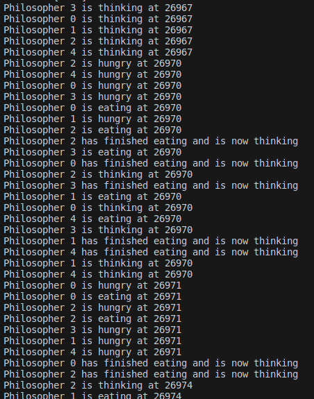
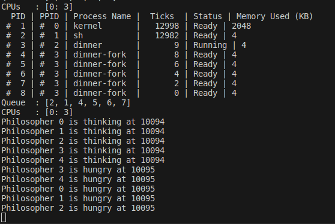
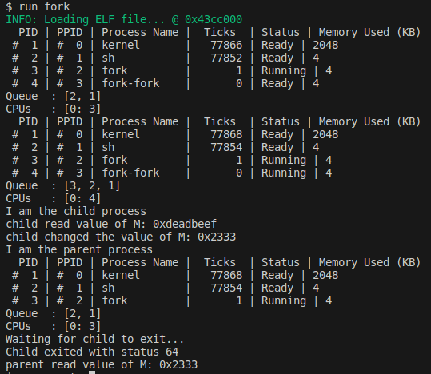
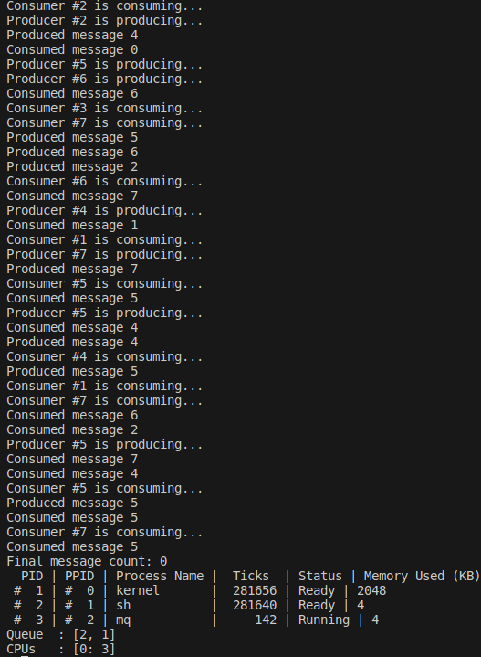
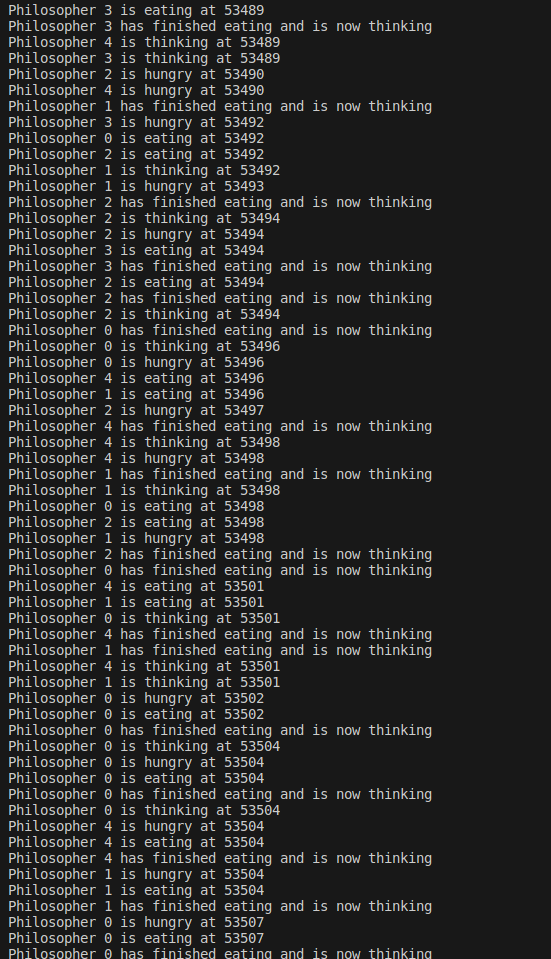

* content
{:toc}


# 实验要求

-   了解 fork 的实现原理，实现 fork 系统调用。kv

-   了解并发与锁机制的概念，实现基于操作系统的自旋锁、信号量。

-   编写基于 fork 的并发程序，并测试自旋锁、信号量的正确性。

# 实验过程

## fork 的实现

在本次实验中，fork系统调用的实现需要注意的地方就是关于父子进程的内存，栈分配的问题，这些问题的规定如下：

-   fork 不复制父进程的内存空间，不实现 Cow (Copy on Write)
    机制，即父子进程将持有一定的共享内存：代码段、数据段、堆、bss 段等。

-   fork
    子进程与父进程共享内存空间（页表），但子进程拥有自己独立的寄存器和栈空间，即在一个不同的栈的地址继承原来的数据。

### 系统调用

和上次实验中我自己实现的sys_time系统调用一样的流程，不再赘述。

### 进程管理

这一次`fork`的实现几乎是完全自主的，所以遇到的问题也就多了点。但是得益于先前实验良好的实现，所以这次实现中可以使用已经实现好的很多方法。

-   第一个问题是`fork`系统调用的返回值，和正常的`fork`一样，子进程返回0，父进程返回子进程的`pid`。通过在完成复制之后设置`rax`的不同的值，从而完成这一任务。

-   第二个问题是栈，页表和上下文的处理。这一部分相当繁琐，（我几乎都实现了复制，好像没有完全按照要求）关于页表的处理，我采用了指南中的尝试分配的方法，栈也是采用的指南的方法。但是上下文在处理中遇到了问题，我在`context`中实现了`get_rsp`和`get_rip`两种方法来获得栈顶地址和指令地址，其中指令地址和父进程一致，栈顶地址根据父进程的栈顶地址进行偏移。（我原先是按照正常分配进程栈空间的形式进行栈顶的计算的，没有考虑到父进程已经执行了一部分内容，栈顶地址已经不是初始值了，我通过索引到报错的地址，发现子进程在尝试进行栈顶地址+10的时候遇到了页错误，所以才发现了这个错误）

``` shell
0x11110000132b                  mov    eax, 0xfffc
   0x111100001330                  int    0x80
   0x111100001332                  lea    rax, [rip+0x3d57]        # 0x111100005090
●→ 0x111100001339                  mov    QWORD PTR [rsp+0x10], rax
   0x11110000133e                  mov    QWORD PTR [rsp+0x18], 0x1
   0x111100001347                  mov    QWORD PTR [rsp+0x30], 0x0
   0x111100001350                  mov    rax, rsp
   0x111100001353                  mov    QWORD PTR [rsp+0x20], rax
   0x111100001358                  mov    QWORD PTR [rsp+0x28], 0x0
```

-   第三个问题是历史遗留问题，就是我`swtich_next`的实现中在判断中只判断了`Ready`状态，没有判断`Running`状态，所以我在`fork`的`switch_next`操作前需要将父进程`pause`才能正常运行。这个问题我在后面实现信号量的时候也遇到了，是在后面才改的。

### 功能测试

这个测试程序主要测试全局变量和局部变量的改变在父子进程中是否符合规则。具体输出详见实验结果。

## 并发与锁机制

本次实验中，主要实现自旋锁（SpinLock）和信号量（Semaphore）两种并发控制机制，以此来处理临界区问题。其中自旋锁的实现并不需要内核态的支持，而信号量则会涉及到进程调度等操作，需要内核态的支持。

### 自旋锁

自旋锁因为本身结构比较简单（获取锁和释放锁），它通过不断地检查锁的状态来实现线程的阻塞，直到获取到锁为止，所以实现起来也很快。

### 信号量

当然，自旋锁由于结构简单，所以会遇到很多问题：

-   忙等待：自旋锁会一直占用 CPU 时间，直到获取到锁为止，这会导致 CPU
    利用率的下降。

-   饥饿：如果一个线程一直占用锁，其他线程可能会一直无法获取到锁。

-   死锁：如果两个线程互相等待对方占有的锁，就会导致死锁。

所以，信号量是一种更好的选择，它可以通过内核态的支持来实现线程的阻塞和唤醒，从而避免了自旋锁的问题。（后面在经典的哲学家问题中会尝试上面这三种情况）

信号量需要实现四种操作：

-   `new`：根据所给出的 key 创建一个新的信号量。

-   `remove`：根据所给出的 key 删除一个已经存在的信号量。

-   `signal`：用于释放一个资源，使得等待的进程可以继续执行。

-   `wait`：用于获取一个资源，如果资源不可用，则进程将会被阻塞。

信号量和`fork`一样，也被设计成一种系统调用，所以系统调用的那一遍流程还是要走一遍。不同的是为了使一种系统调用可以实现上面这四种操作，专门设置了一个op参数用于区分，这一部分在`service.rs`中进行处理。

``` rust
pub fn sys_sem(args: &SyscallArgs, context: &mut ProcessContext) {
    match args.arg0 {
        0 => context.set_rax(new_sem(args.arg1 as u32, args.arg2)),
        1 => context.set_rax(remove_sem(args.arg1 as u32)),
        2 => sem_signal(args.arg1 as u32, context),
        3 => sem_wait(args.arg1 as u32, context),
        _ => context.set_rax(usize::MAX),
    }
}
```

我在实现的过程中也是以此为根基进行的，即需要完成`new_sem`，`remove_sem`，`sem_signal`，`sem_wait`四个函数。

而关于`Semaphore`整个结构的实现，我说说我遇到的问题吧。在正常的C程序中，信号量的使用通常是和while在一起的，但是在本次实验的实现中，一但没有信号量了，就会将进程阻塞。而我遇到的最大的问题就是在`sem_signal`中使用`push_ready()`,正常的实现是只在`sem_signal`中使用`push_ready()`，但是由于我上面提到的那个历史遗留问题（我在`switch_next`的实现中只在Ready状态下才会跳转到这个程序），所以这样会导致程序卡住（在队列里只有没有被阻塞的进程），我在进行多线程计数器的测试的时候，通过在`sem_wait`中也使用`push_ready()`来暂时性地解决这个问题，但是问题是等待队列中会有很多重复的进程。同时由于`push_ready()`是在`sem_wait`中也进行的，所以等待队列的很多顺序也很奇怪。在进行生产者消费者问题的测试时候，这个问题就会暴露出来，导致程序卡住（等待队列中只有生产者而没有消费者）。

### 测试任务

#### 多线程计数器

这是提供的测试程序，正常运行得到的结果在120上下浮动，但是期望的结果是800，这是因为其中有一个加操作需要锁进行保护。

我对这个程序进行了一些修改，使得它能够同时测试自旋锁和信号量。具体结果见实验结果。

#### 消息队列（生产者消费者问题）

因为不清楚有什么现成的队列可以使用，我采用数组和前后指针的方式实现了一个队列。接着在实现完基本的生产者消费者后，加入信号量进行保护。代码见关键代码，结果见实验结果。

#### 哲学家的晚饭

将筷子看作信号量（大小为1），哲学家看作进程，实现哲学家问题。
因为我实现了sys_time，所以我以此作为种子生成随机数以模拟哲学家的思考和用餐时间，但是由于sys*time只精确到秒，所以同一时刻随机出来的都是一样的数字（同一进程fork出来的子进程的sys*time都是一样的，所以生成的随机数都一样），其实随机程度相当有限，就算使用一些技巧，我觉得和使用sys*get_pid没有太大的区别，所以这里提供的随机数方法结合上次实验的sys*time我觉得其实可以改进一下？虽然说我还是正常使用了。

下面是构造出的现象和解决方法：

-   某些哲学家能够成功就餐，即同时拿到左右两侧的筷子。

这是最正常的情况。

{width="60%"}

-   尝试构造死锁情况，即所有哲学家都无法同时拿到他们需要的筷子。

我通过设置相同的思考时间和用餐时间构造了死锁。其实在这个问题中有一种很容易的方案，就是强制先选择编号小的筷子，再选择编号的筷子，这种方案温和地破坏了产生死锁的四个必要条件（互斥条件、占有并等待条件、非抢占条件和循环等待条件）中的一个（循环等待条件），因此在这个方案下产生死锁是不可能的。

{width="60%"}

-   尝试构造饥饿情况，即某些哲学家无法获得足够的机会就餐。

我观察到C有使用Monitor来解决这个问题，其内置有一个等待队列，我们Rust在实现信号量的等待的时候，也是使用了等待队列。所以说饥饿这个问题在我们的实现中已经被规避了。（从后面fish程序的实现和结果来看，这个等待队列似乎并没有想象中那么原子，应该还是有小概率发生饥饿的）

# 关键代码

pkg/kernel/src/interrupt/syscall/service.rs

``` rust
pub fn fork_process(context: &mut ProcessContext) {
    fork(context);
}

pub fn sys_sem(args: &SyscallArgs, context: &mut ProcessContext) {
    match args.arg0 {
        0 => context.set_rax(new_sem(args.arg1 as u32, args.arg2)),
        1 => context.set_rax(remove_sem(args.arg1 as u32)),
        2 => sem_signal(args.arg1 as u32, context),
        3 => sem_wait(args.arg1 as u32, context),
        _ => context.set_rax(usize::MAX),
    }
}
```

pkg/kernel/src/proc/mod.rs

``` rust
pub fn fork(context: &mut ProcessContext) {
    x86_64::instructions::interrupts::without_interrupts(|| {
        let manager = get_process_manager();

        // save_current as parent
        manager.save_current(context);
        let parent_pid = manager.current().pid();
        // fork to get child
        let child_pid = manager.fork();

        // push to child & parent to ready queue
        manager.push_ready(child_pid);
        manager.push_ready(parent_pid);

        // manager.push_ready(parent_pid);
        // info!("Forked process: {} -> {}", parent_pid, manager.current().pid());

        // switch to next process
        manager.switch_next(context);
    })
}

pub fn new_sem(key: u32, val: usize) -> usize {
    x86_64::instructions::interrupts::without_interrupts(|| {
        let manager = get_process_manager();
        let ret = manager.current().write().new_sem(key, val);
        match ret {
            true => 0,
            false => 1,
        }
    })
}

pub fn remove_sem(key: u32) -> usize {
    x86_64::instructions::interrupts::without_interrupts(|| {
        let manager = get_process_manager();
        let ret = manager.current().write().remove_sem(key);
        match ret {
            true => 0,
            false => 1,
        }
    })
}

pub fn sem_signal(key: u32, context: &mut ProcessContext) {
    x86_64::instructions::interrupts::without_interrupts(|| {
        let manager = get_process_manager();
        let ret = manager.current().write().sem_signal(key);
        match ret {
            SemaphoreResult::Ok => {
                context.set_rax(0);
            },
            SemaphoreResult::NotExist => context.set_rax(1),
            SemaphoreResult::WakeUp(pid) => {
                manager.save_current(context);
                if still_alive(pid) {
                    manager.resume(pid);
                    manager.push_ready(pid);
                }
            }
            _ => unreachable!(),
        }
    })
}

pub fn sem_wait(key: u32, context: &mut ProcessContext) {
    x86_64::instructions::interrupts::without_interrupts(|| {
        let manager = get_process_manager();
        let pid = manager.current().pid();
        let ret = manager.current().write().sem_wait(key, pid);
        match ret {
            SemaphoreResult::Ok => {
                context.set_rax(0);
            },
            SemaphoreResult::NotExist => context.set_rax(1),
            SemaphoreResult::Block(pid) => {
                // save, block it, then switch to next
                //        maybe use `save_current` and `switch_next`
                manager.save_current(context);
                if still_alive(pid) {
                    manager.block(pid);
                }
                manager.switch_next(context);
            }
            _ => unreachable!(),
        }
    })
}

pub fn sem_count(key: u32) -> usize {
    x86_64::instructions::interrupts::without_interrupts(|| {
        let manager = get_process_manager();
        manager.current().read().sem_count(key)
    })
}
```

pkg/kernel/src/proc/manager.rs

``` rust
pub fn fork(&self) -> ProcessId {
        // get current process
        let current = self.current();

        // fork to get child
        // add child to process list
        let child = current.fork();
        trace!("New Child {:#?}", &child);
        let child_pid = child.pid();
        self.add_proc(child_pid, child);

        // FOR DBG: maybe print the process ready queue?
        self.print_process_list();
        child_pid
    }

        pub fn block(&self, pid: ProcessId) {
        let binding = self.get_proc(&pid).unwrap();
        let mut pro = binding.write();
        pro.block();
    }

    pub fn resume(&self, pid: ProcessId) {
        let binding = self.get_proc(&pid).unwrap();
        let mut pro = binding.write();
        pro.resume();
    }

    pub fn pause(&self, pid: ProcessId) {
        let binding = self.get_proc(&pid).unwrap();
        let mut pro = binding.write();
        pro.pause();
    }
```

pkg/kernel/src/proc/data.rs

``` rust
pub fn new_sem(&self, key: u32, val: usize) -> bool {
        self.semaphores.write().insert(key, val)
    }

    pub fn remove_sem(&self, key: u32) -> bool {
        self.semaphores.write().remove(key)
    }

    pub fn sem_signal(&self, key: u32) -> SemaphoreResult {
        self.semaphores.write().signal(key)
    }

    pub fn sem_wait(&self, key: u32, pid: ProcessId) -> SemaphoreResult {
        self.semaphores.write().wait(key, pid)
    }

    pub fn sem_count(&self, key: u32) -> usize {
        self.semaphores.read().count(key)
    }
```

pkg/kernel/src/proc/sync.rs

``` rust
use super::ProcessId;
use alloc::collections::*;
use spin::Mutex;
use x86::segmentation::SegmentSelector;
use crate::proc::pid;
#[derive(Clone, Copy, Debug, Eq, PartialEq, Ord, PartialOrd)]
pub struct SemaphoreId(u32);

impl SemaphoreId {
    pub fn new(key: u32) -> Self {
        Self(key)
    }
}

/// Mutex is required for Semaphore
#[derive(Debug, Clone)]
pub struct Semaphore {
    count: usize,
    wait_queue: VecDeque<ProcessId>,
}

/// Semaphore result
#[derive(Debug)]
pub enum SemaphoreResult {
    Ok,
    NotExist,
    Block(ProcessId),
    WakeUp(ProcessId),
}

impl Semaphore {
    /// Create a new semaphore
    pub fn new(value: usize) -> Self {
        Self {
            count: value,
            wait_queue: VecDeque::new(),
        }
    }

    /// Wait the semaphore (acquire/down/proberen)
    ///
    /// if the count is 0, then push the process into the wait queue
    /// else decrease the count and return Ok
    pub fn wait(&mut self, pid: ProcessId) -> SemaphoreResult {
        // if the count is 0, then push pid into the wait queue
        //          return Block(pid)
        // info!("1.Semaphore Wait: {:?}", self.wait_queue);
        if self.count == 0 {
            // if pid == pid::ProcessId(4) {
            //     info!("Wait Block: {:?}", pid);
            // }
            self.wait_queue.push_back(pid);
            return SemaphoreResult::Block(pid);
        }

        // else decrease the count and return Ok
        // info!("2.Semaphore Wait: {:?}", self.wait_queue);
        self.count -= 1;
        SemaphoreResult::Ok
    }

    /// Signal the semaphore (release/up/verhogen)
    ///
    /// if the wait queue is not empty, then pop a process from the wait queue
    /// else increase the count
    pub fn signal(&mut self) -> SemaphoreResult {
        // if the wait queue is not empty
        //          pop a process from the wait queue
        //          return WakeUp(pid)
        // info!("1.Semaphore Signal: {:?}", self.wait_queue);
        if let Some(pid) = self.wait_queue.pop_front() {
            // if pid == pid::ProcessId(4) {
            //     info!("Signal Block: {:?}", pid);
            // }
            return SemaphoreResult::WakeUp(pid);
        }

        // else increase the count and return Ok
        // info!("2.Semaphore Signal: {:?}", self.wait_queue);
        self.count += 1;
        SemaphoreResult::Ok
    }
}

#[derive(Debug, Default)]
pub struct SemaphoreSet {
    sems: BTreeMap<SemaphoreId, Mutex<Semaphore>>,
}

impl SemaphoreSet {
    pub fn count(&self, key: u32) -> usize {
        let sid = SemaphoreId::new(key);

        if let Some(sem) = self.sems.get(&sid) {
            let sem = sem.lock();
            return sem.count;
        }
        
        0
    }

    pub fn insert(&mut self, key: u32, value: usize) -> bool {
        trace!("Sem Insert: <{:#x}>{}", key, value);

        // insert a new semaphore into the sems
        //          use `insert(/* ... */).is_none()`
        self.sems.insert(SemaphoreId::new(key), Mutex::new(Semaphore::new(value))).is_none()
    }

    pub fn remove(&mut self, key: u32) -> bool {
        trace!("Sem Remove: <{:#x}>", key);

        // remove the semaphore from the sems
        //          use `remove(/* ... */).is_some()`
        self.sems.remove(&SemaphoreId::new(key)).is_some()
    }

    /// Wait the semaphore (acquire/down/proberen)
    pub fn wait(&self, key: u32, pid: ProcessId) -> SemaphoreResult {
        let sid = SemaphoreId::new(key);

        // try get the semaphore from the sems
        //         then do it's operation
        if let Some(sem) = self.sems.get(&sid) {
            let mut sem = sem.lock();
            return sem.wait(pid);
        }

        // return NotExist if the semaphore is not exist
        SemaphoreResult::NotExist
    }

    /// Signal the semaphore (release/up/verhogen)
    pub fn signal(&self, key: u32) -> SemaphoreResult {
        let sid = SemaphoreId::new(key);

        // try get the semaphore from the sems
        //         then do it's operation
        if let Some(sem) = self.sems.get(&sid) {
            let mut sem = sem.lock();
            return sem.signal();
        }

        // return NotExist if the semaphore is not exist
        SemaphoreResult::NotExist
    }
}

impl core::fmt::Display for Semaphore {
    fn fmt(&self, f: &mut core::fmt::Formatter<'_>) -> core::fmt::Result {
        write!(f, "Semaphore({}) {:?}", self.count, self.wait_queue)
    }
}
```

pkg/lib/src/sync.rs

``` rust
use core::{
    hint::spin_loop,
    sync::atomic::{AtomicBool, Ordering},
};

use crate::*;

pub struct SpinLock {
    bolt: AtomicBool,
}

impl SpinLock {
    pub const fn new() -> Self {
        Self {
            bolt: AtomicBool::new(false),
        }
    }

    pub fn acquire(&self) {
        // acquire the lock, spin if the lock is not available
        while self.bolt.compare_exchange(false, true, Ordering::Acquire, Ordering::Relaxed).is_err() {
            core::hint::spin_loop();
        }
    }

    pub fn release(&self) {
        // release the lock
        self.bolt.store(false, Ordering::Release);
    }
}

unsafe impl Sync for SpinLock {} // Why? Check reflection question 5

#[derive(Clone, Copy, Debug, PartialEq, Eq, PartialOrd, Ord)]
pub struct Semaphore {
    /* record the sem key */
    key: u32,
}

impl Semaphore {
    pub const fn new(key: u32) -> Self {
        Semaphore { key }
    }

    #[inline(always)]
    pub fn init(&self, value: usize) -> bool {
        sys_new_sem(self.key, value)
    }

    /* other functions with syscall... */
    #[inline(always)]
    pub fn wait(&self) -> bool {
        sys_wait_sem(self.key)
    }

    #[inline(always)]
    pub fn signal(&self) -> bool {
        sys_signal_sem(self.key)
    }

    #[inline(always)]
    pub fn remove(&self) -> bool {
        sys_remove_sem(self.key)
    }
}

unsafe impl Sync for Semaphore {}

#[macro_export]
macro_rules! semaphore_array {
    [$($x:expr),+ $(,)?] => {
        [ $($crate::Semaphore::new($x),)* ]
    }
}
```

pkg/lib/src/syscall.rs

``` rust
#[inline(always)]
pub fn sys_fork() -> usize {
    syscall!(Syscall::Fork)
}

#[inline(always)]
pub fn sys_new_sem(key: u32, value: usize) -> bool {
    syscall!(Syscall::Sem, 0, key as usize, value) == 0
}

#[inline(always)]
pub fn sys_remove_sem(key: u32) -> bool {
    syscall!(Syscall::Sem, 1, key as usize) == 0
}

#[inline(always)]
pub fn sys_signal_sem(key: u32) -> bool {
    syscall!(Syscall::Sem, 2, key as usize) == 0
}

#[inline(always)]
pub fn sys_wait_sem(key: u32) -> bool {
    syscall!(Syscall::Sem, 3, key as usize) == 0
}
```

pkg/app/counter/src/main.rs

``` rust
#![no_std]
#![no_main]

use lib::*;

extern crate lib;

static SEM_ID: u32 = 12345;
const THREAD_COUNT: usize = 8;
static mut COUNTER_0: isize = 0;
static mut COUNTER_1: isize = 0;

static SPIN_LOCK: SpinLock = SpinLock::new();
static SEM: Semaphore = Semaphore::new(SEM_ID);

fn main() -> isize {
    let pid = sys_fork();

    if pid == 0 {
        test_semaphore();
    } else {
        test_spin();
        sys_wait_pid(pid.try_into().unwrap());
    }

    0
}

fn do_counter_inc_0() {
    for _ in 0..100 {
        // protect the critical section
        SPIN_LOCK.acquire();
        inc_counter_0();
        SPIN_LOCK.release();
    }
}

fn do_counter_inc_1() {
    for _ in 0..100 {
        // protect the critical section
        SEM.wait();
        inc_counter_1();
        SEM.signal();
    }
}

/// Increment the counter
///
/// this function simulate a critical section by delay
/// DO NOT MODIFY THIS FUNCTION
fn inc_counter_0() {
    unsafe {
        delay();
        let mut val = COUNTER_0;
        delay();
        val += 1;
        delay();
        COUNTER_0 = val;
    }
}

fn inc_counter_1() {
    unsafe {
        delay();
        let mut val = COUNTER_1;
        delay();
        val += 1;
        delay();
        COUNTER_1 = val;
    }
}


#[inline(never)]
#[no_mangle]
fn delay() {
    for _ in 0..0x100 {
        core::hint::spin_loop();
    }
}

fn test_spin() {
    let mut pids = [0u16; THREAD_COUNT];

    for i in 0..THREAD_COUNT {
        let pid = sys_fork();
        if pid == 0 {
            do_counter_inc_0();
            sys_exit(0);
        } else {
            pids[i] = pid as u16; // only parent knows child's pid
        }
    }

    let cpid = sys_get_pid();
    println!("process #{} holds threads: {:?}", cpid, &pids);
    sys_stat();

    for i in 0..THREAD_COUNT {
        println!("#{} waiting for #{}...", cpid, pids[i]);
        sys_wait_pid(pids[i]);
    }
    println!("COUNTER_0 result: {}", unsafe { COUNTER_0 });
}

fn test_semaphore() {
    SEM.init(1);
    let mut pids = [0u16; THREAD_COUNT];

    for i in 0..THREAD_COUNT {
        let pid = sys_fork();
        if pid == 0 {
            do_counter_inc_1();
            sys_exit(0);
        } else {
            pids[i] = pid as u16; // only parent knows child's pid
        }
    }

    let cpid = sys_get_pid();
    println!("process #{} holds threads: {:?}", cpid, &pids);
    sys_stat();

    for i in 0..THREAD_COUNT {
        println!("#{} waiting for #{}...", cpid, pids[i]);
        sys_wait_pid(pids[i]);
    }
    println!("COUNTER_1 result: {}", unsafe { COUNTER_1 });
    SEM.remove();
}

entry!(main);
```

pkg/app/mq/src/main.rs

``` rust
#![no_std]
#![no_main]

use lib::*;

extern crate lib;

static PROD_ID: u32 = 23456;
static CONS_ID: u32 = 34567;
const THREAD_COUNT: usize = 16;
static mut MSG_QUEUE: [Option<usize>; THREAD_COUNT / 2] = [None; THREAD_COUNT / 2];
static mut MSG_L: usize = 0;
static mut MSG_R: usize = 0;
static SEM_PROD: Semaphore = Semaphore::new(PROD_ID);
static SEM_CONS: Semaphore = Semaphore::new(CONS_ID);
static SPIN_L: SpinLock = SpinLock::new();

fn main() -> isize {
    SEM_PROD.init((THREAD_COUNT / 2) as usize);
    SEM_CONS.init(0);
    let mut pids = [0u16; THREAD_COUNT];
    
    for i in 0..THREAD_COUNT {
        let pid = sys_fork();
        if pid == 0 {
            if i < THREAD_COUNT / 2 {
                for _ in 0..10 {
                    produce(i);
                }
            } else {
                for _ in 0..10 {
                    consume(i);
                }
            }

            sys_exit(0);
        }
        else{
            pids[i] = pid as u16;
        }
    }

    for i in 0..THREAD_COUNT {
        sys_wait_pid(pids[i]);
    }

    unsafe{
        println!("Final message count: {}", MSG_R - MSG_L);
    }

    sys_stat();
    SEM_PROD.remove();
    SEM_CONS.remove();

    0
}

fn produce(i: usize) {
    SEM_PROD.wait();
    println!("Producer #{} is producing...", i);

    unsafe {
        SPIN_L.acquire();
        if MSG_R == MSG_L {
            println!("Message queue is empty");
        }
        if (MSG_R - MSG_L + THREAD_COUNT / 2) % (THREAD_COUNT / 2) == THREAD_COUNT / 2 - 1 {
            println!("Message queue is full");
        }
        MSG_QUEUE[MSG_R] = Some(i);
        MSG_R += 1;
        MSG_R %= THREAD_COUNT / 2;
        SPIN_L.release();
        println!("Produced message {}", i);
    }
    
    SEM_CONS.signal();
}

fn consume(i: usize) {
    SEM_CONS.wait();
    println!("Consumer #{} is consuming...", i - (THREAD_COUNT/2) as usize);

    unsafe {
        SPIN_L.acquire();
        if MSG_R == MSG_L {
            println!("Message queue is empty");
        }
        if (MSG_R - MSG_L + THREAD_COUNT / 2) % (THREAD_COUNT / 2) == THREAD_COUNT / 2 - 1 {
            println!("Message queue is full");
        }
        let val = MSG_QUEUE[MSG_L].take();
        MSG_L += 1;
        MSG_L %= THREAD_COUNT / 2;
        SPIN_L.release();
        match val {
            Some(v) => println!("Consumed message {}", v),
            None => println!("No message to consume"),
        }
    }

    SEM_PROD.signal();
}

entry!(main);
```

pkg/app/dinner/src/main.rs

``` rust
#![no_std]
#![no_main]

use lib::*;
extern crate lib;

use rand::prelude::*;
use rand_chacha::ChaCha20Rng;

const PHILOSOPHERS: usize = 5;
static CHOPSTICK: [Semaphore; PHILOSOPHERS] = semaphore_array![99991, 99992, 99993, 99994, 99995];

fn main() ->isize {
    for i in 0..PHILOSOPHERS {
        CHOPSTICK[i].init(1);
    }
    let mut pids = [0u16; PHILOSOPHERS];
    for i in 0..PHILOSOPHERS {
        let pid = sys_fork();
        if pid == 0 { 
            philosopher(i);
            sys_exit(0);
        }
        else{
            pids[i] = pid as u16;
        }
    }

    for i in 0..PHILOSOPHERS {
        sys_wait_pid(pids[i]);
    }

    for i in 0..PHILOSOPHERS {
        CHOPSTICK[i].remove();
    }

    0
}

pub fn sleep(secs: usize) {
    let start = sys_time();
    let mut current = start;
    while current - start < secs {
        current = sys_time();
    }
}

fn philosopher(i: usize) {
    let time = sys_time();
    let mut rng = ChaCha20Rng::seed_from_u64(time as u64);
    for _ in 0..10 {
        println!("Philosopher {} is thinking at {}", i, sys_time());

        let sleep_time = rng.gen::<u64>() % 5;
        sleep(sleep_time as usize);

        // if i == 0 {
        //     sleep(2);
        // }
        // if i == 1 {
        //     sleep(0);
        // }
        // if i == 2 {
        //     sleep(4);
        // }
        // if i == 3 {
        //     sleep(0);
        // }
        // if i == 4 {
        //     sleep(6);
        // }

        println!("Philosopher {} is hungry at {}", i, sys_time());
        pickup(i);
        
        println!("Philosopher {} is eating at {}", i, sys_time());
        let sleep_time = rng.gen::<u64>() % 5;
        sleep(sleep_time as usize);

        // if i == 0 {
        //     sleep(1);
        // }
        // if i == 1 {
        //     sleep(1);
        // }
        // if i == 2 {
        //     sleep(1);
        // }
        // if i == 3 {
        //     sleep(1);
        // }
        // if i == 4 {
        //     sleep(1);
        // }

        putdown(i);
        println!("Philosopher {} has finished eating and is now thinking", i);
    }
}

fn pickup(i: usize) {
    let left = i;
    let right = (i + 1) % PHILOSOPHERS;
    // println!("Philosopher {} is picking up chopsticks {} and {}", i, left, right);

    // Always pick up the lower numbered chopstick first
    if left < right {
        CHOPSTICK[left].wait();
        CHOPSTICK[right].wait();
    } else {
        CHOPSTICK[right].wait();
        CHOPSTICK[left].wait();
    }
}

fn putdown(i: usize) {
    let left = i;
    let right = (i + 1) % PHILOSOPHERS;

    CHOPSTICK[left].signal();
    CHOPSTICK[right].signal();
    // println!("Philosopher {} has put down chopsticks {} and {}", i, left, right);
}

entry!(main);
```

# 实验结果

fork: {width="60%"}

counter: {width="60%"}

mq: {width="60%"}

dinner: {width="60%"}

# 实验总结

这次实验主要包括fork，自旋锁和信号量的实现，还有几个关于锁的经典问题的实现。巩固了很多关于这些内容的理论知识，同时也使得所实现的操作系统更加强大。

# 思考题&加分项

## 在 Lab 2 中设计输入缓冲区时，如果不使用无锁队列实现，而选择使用 Mutex 对一个同步队列进行保护，在编写相关函数时需要注意什么问题？考虑在进行 pop 操作过程中遇到串口输入中断的情形，尝试描述遇到问题的场景，并提出解决方案。

使用Mutex保护一个同步队列时，需要确保在任何时候都只有一个线程能访问队列。一个要注意的问题是，当处理异步事件（比如串口输入中断）时，如果在已经持有锁的上下文中出现，那就可能出现死锁的情况。这是因为，若那个中断处理程序也想获取同一个锁（为了向队列添加新的字符），这就产生了问题，因为锁是不可重入的。

遇到这个问题的一个场景如下：你在一个线程中调用pop操作尝试从队列中移除一个元素，并以此获取了Mutex锁。然后在你尚未释放Mutex，在pop操作完成之前，突然发生一个串口输入中断。中断处理程序试图执行push操作将新的字符加到队列中。然而，这就需要获取同一个Mutex锁，因此中断处理程序被阻塞，直到第一个线程释放Mutex锁为止。但是，无法释放Mutex，因为中断处理程序不能被打断，所以这俩程序互相等待，导致死锁。

一个解决方案可能是使用中断禁止来代替锁机制。在开始pop操作时，通过禁止硬件中断，保证在操作期间，不会遇到新的串口输入中断。当pop操作完成后，重启硬件中断。

另一种解决方案是在处理中断时不直接执行push操作，而是将字符放入一个独立的内核数据结构（例如一个队列）。然后，当线程可以运行并且没有锁的时候，再进行实际的push操作。这种方式需要更多的数据拷贝和在内核中处理同步的复杂性，但是可以避免死锁。

还可以使用可重入的锁（例如递归Mutex或者自旋锁）作为一种备选方案。但是，这种方法需要小心地处理锁的所有权和回收机制，否则仍然可能遇到死锁。

## 在进行 fork 的复制内存的过程中，系统的当前页表、进程页表、子进程页表、内核页表等之间的关系是怎样的？在进行内存复制时，需要注意哪些问题？

-   系统当前页表：是操作系统当前正在使用的页表，指向的是正在执行的进程对应的页表。

-   进程页表：是一个进程自身对应的页表，其中包含了该进程在虚拟内存空间中的所有页面的映射。

-   子进程页表：当执行fork操作创建新的子进程时，需要复制一份父进程的页表，然后将其修改、更新，成为子进程的页表。

-   内核页表：用于在内核空间中使用的页表，所有进程都可以访问，这使得系统调用和中断服务程序能够被正确地执行。

在进行内存复制时，需要注意以下几个问题：

-   页表的复制：在实现fork操作时，必须正确地复制和更新页表。否则，新的进程可能会引用错误的内存区域，或者无法访问其应该能够访问的内存区域。

-   内存对齐：由于硬件的限制，许多系统对内存分配有一定的对齐要求，以便高效地访问内存。在进行内存复制时，需要确保新分配的内存区域符合这些对齐要求。

-   确保原子性：
    fork操作必须是原子的，这意味着在复制内存的过程中，其他线程（包括中断处理程序）不能访问正在被复制的内存区域。这样可以确保数据的一致性，避免数据竞争。

## 为什么在实验的实现中，fork 系统调用必须在任何 Rust 内存分配（堆内存分配）之前进行？如果在堆内存分配之后进行 fork，会有什么问题？

因为在fork系统调用中创建一个新进程时要复制父进程的整个进程空间，包括堆内存。

可能的问题：

-   内存分配器状态:
    如果你在分配内存后立刻进行fork，内存分配器的状态会被复制到子进程。然而，父进程和子进程没有共享内存，因此这个复制的内存分配器状态可能就会引起数据不一致的问题。

-   并发问题和资源泄露:
    如果在fork之后立即进行内存分配，然后子进程退出，那么分配的内存可能就会丢失，因为这个内存分配是在父进程的地址空间中（被子进程复制了一份）。在子进程退出时，这部分内存不会被释放，而父进程可能永远也无法访问这部分内存，导致资源泄漏。

## 进行原子操作时候的 Ordering 参数是什么？此处 Rust 声明的内容与 C++20 规范 中的一致，尝试搜索并简单了解相关内容，简单介绍该枚举的每个值对应于什么含义。

在Rust中，Ordering参数用于指定原子操作应该如何同步对内存的访问。Ordering有五个可能的值，其中每个值定义了一种不同的内存排序语意：

-   `Relaxed`：在这种顺序下，原子操作不提供任何排序语义，不保证任何对内存操作的顺序。只保证当前操作本身是原子的。

-   `Acquire`：它用于读操作。确保所有在此Acquire操作之前的读或写操作都不会被重排到此Acquire操作之后。这就防止了所谓的"Load/Load"和"Load/Store"重排。

-   `Release`：它用于写操作。确保所有在此Release操作之后的读或写操作都不会被重排到此Release操作之前。这防止了"Store/Store"和"Load/Store"的重排。

-   `AcqRel`：它同时具有Acquire和Release语义，适用于读-改-写操作，如fetch*add、fetch*sub等。

-   `SeqCst`：
    它提供最强的同步级别，保证全局顺序，也就是所有线程都看到相同的操作顺序。这是最严格的内存顺序模型。

这些枚举值约定了内存的存取顺序，用于控制并发程序中的内存访问。同时，编译器或处理器可能会对在原子操作附近的非原子操作的指令进行重排。Ordering枚举的各个值定义了两者可以重排序的程度，以更好地对性能进行优化。

## 在实现 `SpinLock` 的时候，为什么需要实现 `Sync trait`？类似的 `Send trait` 又是什么含义？

`Sync`和`Send`都是Rust中的`trait`，它们被用来允许类型在并发环境中安全地使用。
当一个类型实现了`Sync trait`时，这表示这个类型的实例是线程安全的，可以安全地在多个线程之间共享。也就是说，任何一个在多个线程间共享的引用必须是Sync的。所以，在你实现SpinLock的时候，需要实现`Sync trait`，因为SpinLock被设计为可以在线程之间安全地共享。

`Send trait`则是表示某个类型的所有权可以在线程间传递。也就是说，如果一种类型T实现了`Send`，那么T的所有权可以安全地移动到另一个线程。这常常被用在多线程环境中的任务系统中，例如，你可以把一系列任务发送到一个线程池中去处理，这时候就需要用到`Send trait`。

总的来说，`Send`和`Sync`两个trait代表了两种并发性质：

-   `Send`：允许类型的所有权转移到其他线程。

-   `Sync`：允许类型在线程间安全共享。

注意的是，对于某些类型，如一些原子类型和锁，Rust无法自动推导出它们是`Sync`的，所以我们需要手动为它们实现`Sync trait`。

## `core::hint::spin_loop` 使用的 `pause` 指令和 Lab 4 中的 `x86_64::instructions::hlt` 指令有什么区别？这里为什么不能使用 `hlt` 指令？

`core::hint::spin_loop`函数使用的`pause`指令和`x86_64::instructions::hlt`的hlt指令是有区别的。`pause`指令用于减少`spin-wait`循环对CPU的功耗与占用，同时帮助其他的线程或进程更快地获取资源。当CPU检测到这个指令时，它会暂时停止执行当前线程的指令，转而执行其他线程的指令，暂停会在很短的时间内结束，然后CPU会继续执行当前线程的指令。

而`hlt`指令用于将CPU置于低功耗状态直到发生硬件中断。一旦发生中断，CPU就会恢复执行。在这种意义上，使用`hlt`指令程序将停止执行，直到一个中断发生（比如硬件设备的调用或者系统的调用）。在这个期间，CPU几乎不消耗功率，直到中断到来。
因此`hlt`指令经常用于操作系统在等待事件时进入低功率模式，以节约能源。而`pause`指令用于告诉CPU，接下来的操作会重复很多次，比如等待某个条件满足。

不能使用`hlt`指令是因为这会使当前的CPU进入休眠状态直到一个中断发生。但在自旋锁的
`acquire`
中，我们需要CPU在锁没有被释放时一直检查锁的状态，直到锁被释放。如果使用`hlt`的话，当前的CPU在锁未释放时就被休眠了，而无法及时响应锁的释放，因此会影响程序的执行逻辑。

## 参考信号量相关系统调用的实现，尝试修改 `waitpid` 系统调用，在进程等待另一个进程退出时进行阻塞，并在目标进程退出后携带返回值唤醒进程。

原先的这个实现的有点别扭。应该是存在多个进程同时wait同一个pid的情况，这种实现完全不能处理这种情况。

``` rust
pub fn exit_process(args: &SyscallArgs, context: &mut ProcessContext) {
    // exit process with retcode
    let ret = args.arg0 as isize;
    let manager = get_process_manager();
    let pid = manager.current().pid().0;
    sem_signal(pid.into(), context);

    exit(ret, context);
}

pub fn sys_wait_pid(args: &SyscallArgs, context: &mut ProcessContext) -> isize {
    let pid = args.arg0;
    let manager = get_process_manager();
    let current_pid = manager.current().pid().0;
    if let Some(ret) = manager.check_proc(&ProcessId(pid as u16)) {
        ret
    }
    else {
        sem_wait(current_pid as u32, context);
        -1
    }
}
```

后来多加了一个查看sem的count值的方法，然后稍微的改进了一下。

``` rust
pub fn exit_process(args: &SyscallArgs, context: &mut ProcessContext) {
    // exit process with retcode
    let ret = args.arg0 as isize;
    let manager = get_process_manager();
    let pid = manager.current().pid().0;
    while sem_count(pid.into()) > 0 {
        sem_signal(pid.into(), context);
    }

    exit(ret, context);
}

pub fn sys_wait_pid(args: &SyscallArgs, context: &mut ProcessContext) -> isize {
    let pid = args.arg0;
    let manager = get_process_manager();
    if let Some(ret) = manager.check_proc(&ProcessId(pid as u16)) {
        ret
    }
    else {
        sem_wait(pid as u32, context);
        -1
    }
}
```

不过这个实现占用了一些key，所以在实际的使用中可能会有问题。

## 尝试实现如下用户程序任务，完成用户程序 fish：

创建三个子进程，让它们分别能输出且只能输出 `>`，`<` 和 `_`。
使用学到的方法对这些子进程进行同步，使得打印出的序列总是 `<><_` 和
`><>_` 的组合。
在完成这一任务的基础上，其他细节可以自行决定如何实现，包括输出长度等。

我使用了两个信号量完成这一任务，我上面有说过信号量里面内置了等待队列，所以理论上像下面这样简单的实现应该是可行的。

``` rust
#![no_std]
#![no_main]

use lib::*;
extern crate lib;

const SEM_T_ID: u32 = 12345;
const SEM_UD_ID: u32 = 23456;

static SEM_T: Semaphore = Semaphore::new(SEM_T_ID);
static SEM_UD: Semaphore = Semaphore::new(SEM_UD_ID);
static mut CNT : isize = 0;

fn child_gt() {
    loop {
        SEM_T.wait();
        unsafe{
            CNT += 1;
        }
        print!(">");
        if unsafe{CNT} % 3 != 0{
            SEM_T.signal();
            if (unsafe{CNT} + 1) / 3 >= 100 {
                break;
            }
        }
        else{
            SEM_UD.signal();
            if unsafe{CNT} / 3 >= 100 {
                break;
            }
        }
    }
}

fn child_lt() {
    loop {
        SEM_T.wait();
        unsafe{
            CNT += 1;
        }
        print!("<");
        if unsafe{CNT} % 3 != 0{
            SEM_T.signal();
            if (unsafe{CNT} + 1) / 3 >= 100 {
                break;
            }
        }
        else{
            SEM_UD.signal();
            if unsafe{CNT} / 3 >= 100 {
                break;
            }
        }
    }
}

fn child_ud() {
    loop {
        SEM_UD.wait();
        print!("_");
        if unsafe{CNT} / 3 >= 100 {
            break;
        }
        SEM_T.signal();
    }
}

fn main() -> isize {
    SEM_T.init(1);
    SEM_UD.init(0);

    let child_gt_pid = sys_fork();
    if child_gt_pid == 0 {
        child_gt();
        sys_exit(0);
    }

    let child_lt_pid = sys_fork();
    if child_lt_pid == 0 {
        child_lt();
        sys_exit(0);
    }

    let child_ud_pid = sys_fork();
    if child_ud_pid == 0 {
        child_ud();
        sys_exit(0);
    }

    sys_wait_pid(child_gt_pid as u16);
    sys_wait_pid(child_lt_pid as u16);
    sys_wait_pid(child_ud_pid as u16);
    println!();
    SEM_T.remove();
    SEM_UD.remove();

    0
}

pub fn sleep(secs: usize) {
    let start = sys_time();
    let mut current = start;
    while current - start < secs {
        current = sys_time();
    }
}

entry!(main);
```

下面是正确的结果。

{width="80%"}

但事实上呢？有很小的概率会产出错误结果。

{width="80%"}

这里面有一条不合群的小鱼`><<_`。这说明信号量里面的等待队列并没有我想象的那么原子，还是有后来的反而排的前面的情况。当然经过测试这是很小的概率，但是这个问题还是存在的。

## 尝试和前文不同的其他方法解决哲学家就餐问题，并验证你的方法能够正确解决它，简要介绍你的方法，并给出程序代码和测试结果。

（这里问的不太明确？）其实我的解决方案就和上文有一些不一样。我通过设置相同的思考时间和用餐时间构造了死锁。其实在这个问题中有一种很容易的方案，就是强制先选择编号小的筷子，再选择编号的筷子，这种方案温和地破坏了产生死锁的四个必要条件（互斥条件、占有并等待条件、非抢占条件和循环等待条件）中的一个（循环等待条件），因此在这个方案下产生死锁是不可能的。
